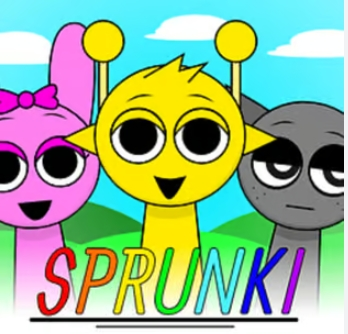

# Sprunki Swapped: A Fun and Exciting Adventure Game

## Introduction

Hey there! Are you ready to dive into an amazing world of adventure, puzzles, and fun? Let me introduce you to **Sprunki Swapped**, a fantastic game that will keep you entertained for hours. In this game, you’ll explore colorful worlds, solve tricky puzzles, and meet interesting characters. Whether you’re a beginner or a seasoned gamer, Sprunki Swapped has something for everyone. Let’s get started and learn all about this awesome game!

**👉👉 Click to play*: [Sprunki Swapped](https://sprunkiswapped.pages.dev) 

## What is Sprunki Swapped?

Sprunki Swapped is an adventure puzzle game where players take on the roles of two main characters, Sprunki and Swapped. These characters have unique abilities that they must use together to overcome challenges and complete levels. The game is set in a vibrant, magical world filled with secrets, treasures, and surprises. Your goal is to guide Sprunki and Swapped through various levels, solving puzzles, defeating enemies, and collecting rewards along the way.

## The Storyline

The game begins in the peaceful land of Lumina, where Sprunki and Swapped live happily. One day, an evil sorcerer named Malvaron casts a spell that swaps their abilities. Sprunki, who was once a master of speed, now has the power of strength, while Swapped, who was strong, now has the power of speed. To restore balance to their world, they must embark on a journey to find the magical Crystal of Lumina, which can reverse the spell.

Throughout their adventure, Sprunki and Swapped will travel through different lands, such as the Enchanted Forest, the Crystal Caves, and the Cloudy Peaks. Each land has its own unique challenges and puzzles that require the characters to work together using their swapped abilities. Along the way, they’ll meet friendly creatures who will help them, as well as dangerous enemies who will try to stop them.

## Gameplay

### Characters and Abilities

- **Sprunki**: Originally the fastest character in Lumina, Sprunki now has the power of strength. This means Sprunki can push heavy objects, break through barriers, and defeat tough enemies with powerful punches.
  
- **Swapped**: Once the strongest character, Swapped now has the power of speed. Swapped can run quickly, jump over gaps, and dodge enemies with ease.

### Levels and Challenges

The game is divided into several levels, each set in a different part of Lumina. Each level has its own unique challenges, such as:

- **Puzzles**: You’ll need to solve puzzles by using Sprunki and Swapped’s abilities together. For example, Sprunki might need to push a block to create a bridge, while Swapped uses speed to reach a switch.
  
- **Platforming**: There are many platforms to jump on, gaps to cross, and obstacles to avoid. Swapped’s speed is especially useful here.
  
- **Combat**: You’ll encounter enemies that you need to defeat. Sprunki’s strength is perfect for taking down tough foes, while Swapped can quickly dodge attacks.

### Collectibles

Throughout the game, you can collect various items, such as:

- **Coins**: Collect coins to buy upgrades and items in the game’s shop.
  
- **Gems**: Gems are rare and valuable. Collecting all the gems in a level unlocks special rewards.
  
- **Power-Ups**: These give Sprunki and Swapped temporary boosts, like extra strength or increased speed.

### Boss Battles

At the end of each land, you’ll face a boss battle against one of Malvaron’s minions. These battles are more challenging and require you to use all of your skills and abilities to defeat the boss.

## Graphics and Sound

Sprunki Swapped features bright, colorful graphics that make the world of Lumina come alive. The characters are cute and expressive, and the environments are detailed and immersive. The sound effects and music are also top-notch, with catchy tunes that match the mood of each level.

## Why You’ll Love Sprunki Swapped

1. **Fun and Challenging**: The game is easy to pick up but offers plenty of challenges to keep you engaged.
   
2. **Teamwork**: You’ll need to use both characters’ abilities to succeed, which makes the gameplay more interesting.
   
3. **Exploration**: There are lots of secrets to discover and treasures to collect, encouraging you to explore every level.
   
4. **Great for All Ages**: Whether you’re a kid or just a kid at heart, Sprunki Swapped is enjoyable for players of all ages.

## Tips for Playing Sprunki Swapped

1. **Plan Ahead**: Before jumping into a level, take a moment to look around and plan your moves. This will help you avoid traps and solve puzzles more efficiently.
   
2. **Use Both Characters**: Don’t forget to use both Sprunki and Swapped’s abilities. Sometimes you’ll need to switch between them to overcome obstacles.
   
3. **Collect Everything**: Try to collect as many coins and gems as you can. They’ll come in handy later for upgrades and rewards.
   
4. **Practice Makes Perfect**: If you’re having trouble with a level, don’t give up! Keep practicing, and you’ll get better over time.

## Conclusion

Sprunki Swapped is an exciting and fun adventure game that’s perfect for anyone who loves puzzles, platforming, and teamwork. With its colorful graphics, engaging gameplay, and charming characters, it’s a game that you’ll want to play again and again. So what are you waiting for? Grab your controller and join Sprunki and Swapped on their magical journey to save Lumina!

---

That’s it! I hope you enjoyed learning about Sprunki Swapped. Now it’s your turn to play and experience the adventure for yourself. Have fun!